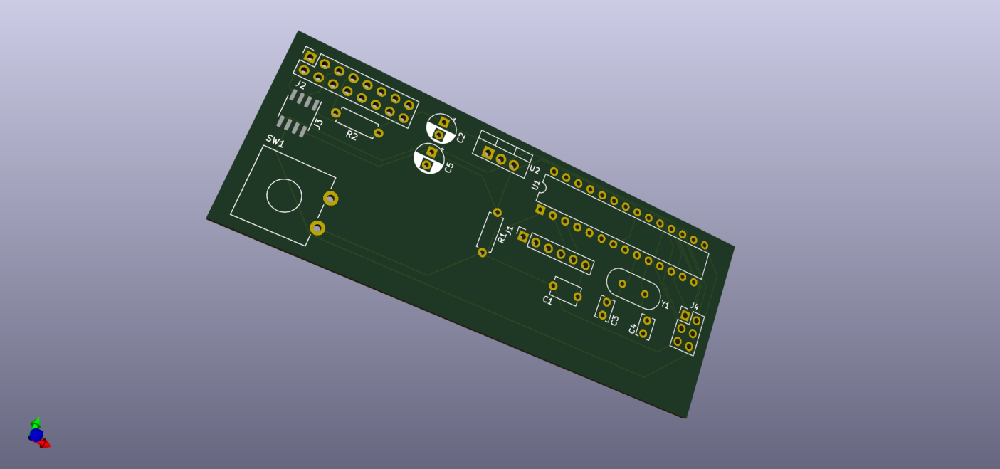

# MegaOBD
obd2 simulator addon for MS3 based ECUs. Currently targeted at the 01-05 
Mazda Miata.  

## Building the code
either use the Arduino IDE, or just call `make`

## Relevant docs
[Miata ECU hacking](http://ecuhacking101.blogspot.com/2011/01/nb-miata-obd-mode-2.html)
[OBD2 pids](https://en.wikipedia.org/wiki/OBD-II_PIDs#Modes)